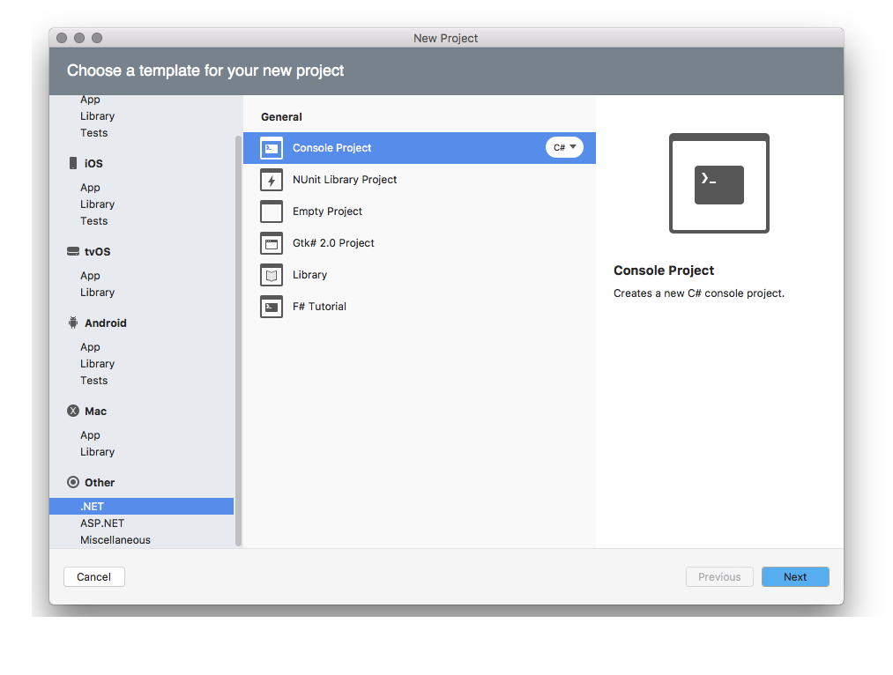
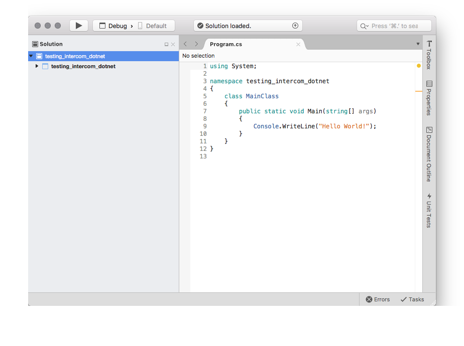
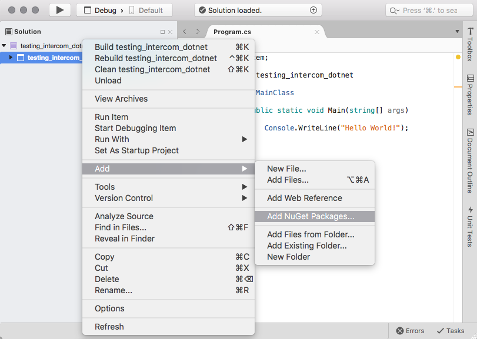
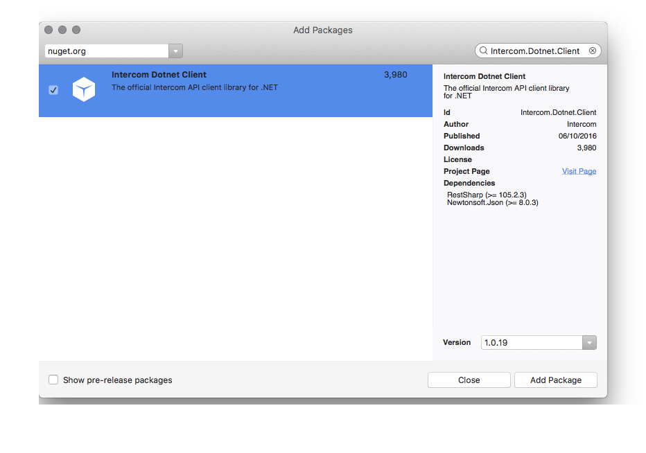
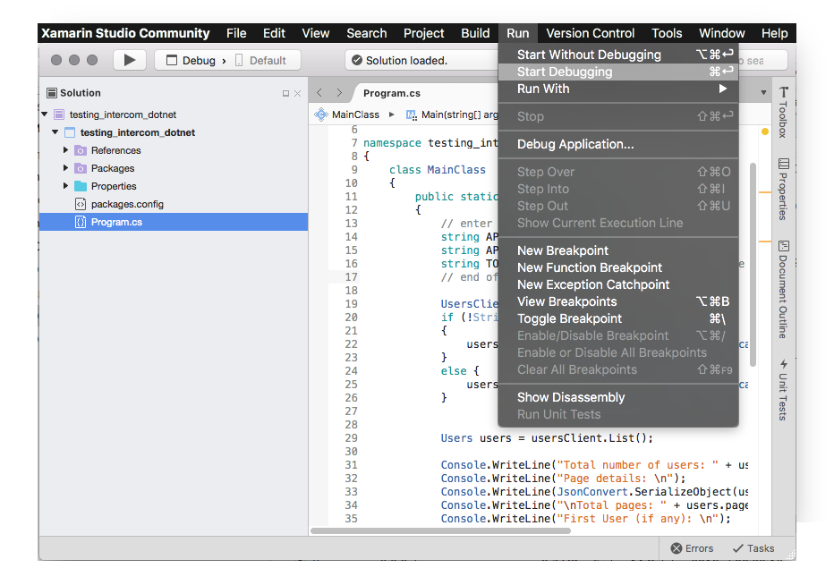

# Using the Intercom API with .NET 

## General .NET Information

### Editors
- Visual Studio IDE: https://www.visualstudio.com/
	- Windows only
	- Compatible with all version of .NET
- Xamarin: https://www.xamarin.com/
	- Cross platform
	- Compatible with all version of .NET
- Visual Studio Code: https://code.visualstudio.com/
	- Cross platform
	- Compatible with .NET Core (formely .NET 5) and above

### Installing packages (.NET 4 and below)
- Can be done by imported DLL into existing project but now mostly via NuGet

#### NuGet
- Website with search of available libraries: https://www.nuget.org/ 
- Add packages within the visual interface of the editor / command line `Install-Package packageName'
- Packages installed saved in a `packages.config` file
- Restore packages: visual editors will have a typical "Right click on project > Restore packages" option
- Saving packages to `packages.config`: happens automatically when adding the package

## Test intercom-dotnet

### Installation

- Follow latest details as per https://github.com/intercom/intercom-dotnet
- Currently
    - Only supports .NET 4
    - Install via: `Install-Package Intercom.Dotnet.Client`
    - or install `Intercom.Dotnet.Client` via NuGet via a visual interface

### Running 

#### Xamarin
- Open `/xamarin/testing_intercom_dotnet/testing_intercom_dotnet.sln`
- Modify `/xamarin/testing_intercom_dotnet/testing_intercom_dotnet/Program.cs` to insert your API keys / access tokens 
- Running the code: run via the visual interface

## Setting up a new project

- Create a new Solution

- Select Other > .NET > Console Project

- Specify project details

- See new Solution created

- Add dependencies

- Install Intercom package

- Add code to utilise the Intercom API and Run solution

